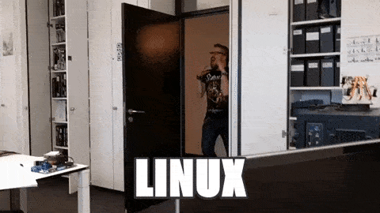

# Arch installation
https://wiki.archlinux.org/index.php/Installation_guide

Add to pacstrap
```
base-devel linux-lts-headers intel-ucode git stow sudo vim fish terminus-font
```

## Boot params
- modprobe.blacklist=nouveau,iTCO_wdt - disable buggy nouveau driver and watchdog module
- i915.enable_guc=2 - ???
- pci=nommconf - disables wlan AER bugs spamming, OR pcie_aspm=off - for buggy aspm implementation
- nvidia-drm.modeset=1
- nowatchdog - disables both soft and hard watchdogs


# After installation
https://wiki.archlinux.org/index.php/General_recommendations

## Virtual console
/etc/vconsole.conf
```
KEYMAP=pl
FONT=ter-220b
```

## Set pacman mirrolist
`vim /etc/pacman.d/mirrorlist`

## Create user and add to sudoers
-m create home, -G group, -s shell
```
useradd -m -G wheel -s /bin/fish piotr
passwd piotr
EDITOR=vim visudo
```

```
%wheel ALL=(ALL) NOPASSWD: ALL
```


# Relogin as user

## Stow dotfiles

## Install yay
```
git clone https://aur.archlinux.org/yay.git
cd yay
makepkg -si
```

## Install all packages

```sh
./dotfiles/install.sh
./dotfiles/install-aur.sh
```

## Enable services

```
sudo systemctl enable systemd-timesyncd.service
sudo systemctl start systemd-timesyncd.service
sudo systemctl enable NetworkManager.service
sudo systemctl start NetworkManager.service
sudo systemctl enable bluetooth.service
sudo systemctl start bluetooth.service
sudo systemctl enable cups.service
sudo systemctl start cups.service
```

## Done


